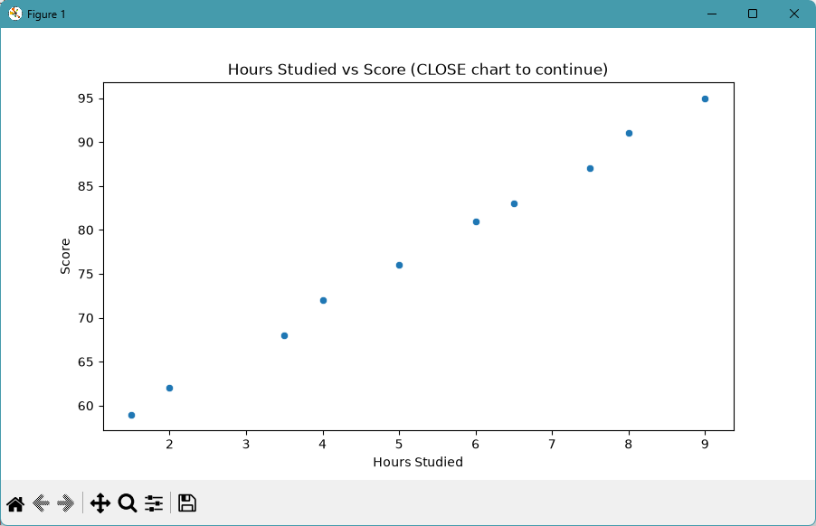

# Sandra Otubushin – ML 04 Regression Project

> Professional Python project completed by **Sandra Otubushin** using regression models to predict Titanic passenger fares.

---

# Author

**Sandra Otubushin**

- GitHub Repository: https://github.com/sandra8918/ml-04-regression
- GitHub Pages: https://sandra8918.github.io/ml-04-regression/

---

# Project Description

This project applies supervised machine learning regression techniques to predict the **fare** paid by Titanic passengers. Several regression models were trained and compared using different combinations of input features to determine which model produced the most accurate predictions.

The project demonstrates:

- Data exploration and preparation
- Feature engineering
- Linear Regression
- Ridge Regression
- Elastic Net Regression
- Polynomial Regression
- Model evaluation using MAE, RMSE, and R²
- Comparison of regression model performance

---

# Project Notebook

### My Regression Notebook

- [ml04_sandra_otubushin.ipynb](notebooks/project04/ml04_sandra_otubushin.ipynb)

### Example Notebook

- [ml_04_case.ipynb](notebooks/ml_04_case.ipynb)

---

# Working Files

This project uses the following folders:

- **data/raw/** – stores the source datasets.
- **docs/** – contains project documentation and narrative.
- **src/mlstudio/** – contains the example regression application.
- **notebooks/** – contains interactive notebooks for regression analysis.
- **pyproject.toml** – project configuration and dependencies.
- **zensical.toml** – documentation and project metadata.

---

# My Project Summary

For my custom project, I predicted **Titanic passenger fares** using regression models.

The following feature combinations were evaluated:

- Age
- Family Size
- Age + Family Size
- Age + Family Size + Sex

The best-performing linear regression model used:

- Age
- Family Size
- Sex

Additional models including Ridge Regression, Elastic Net, and Polynomial Regression were compared to evaluate model performance and reduce the possibility of overfitting.

---

# Findings and Visualizations

### Figure 1 – Regression Analysis

This visualization illustrates the relationship between the selected input features and the predicted passenger fares.

---

### Figure 2 – Model Coefficients

This chart displays the learned coefficients from the regression model. It illustrates the relative influence of each feature on the predicted fare.

---

# Results

The project demonstrated that using multiple input features produced better predictions than using a single feature.

Key observations included:

- Age alone was a weak predictor of fare.
- Combining multiple features improved model performance.
- Ridge Regression and Elastic Net produced similar results while helping reduce overfitting.
- Model performance was evaluated using **MAE**, **RMSE**, and **R²**.

---

# Documentation

Additional project documentation is available in:

- [docs/index.md](docs/index.md)

---

# Citation

[CITATION.cff](./CITATION.cff)

---

# License

[MIT](./LICENSE)
